## 一、研究背景（Background）

Transformer 模型已经成为自然语言处理、计算机视觉以及多模态任务中的主流架构，其核心计算模块是自注意力（Self-Attention）机制。标准自注意力的计算形式为：

$$S = QK^\top,\quad P = \mathrm{softmax}(S),\quad O = PV$$

其中$$Q,K,V \in \mathbb{R}^{N \times d}，N $$表示序列长度，d 表示特征维度。

计算流程如下：

1. 计算 QK^T：需存储一个n*n 矩阵；

2. 计算 softmax；

3. 乘以 V 得到最终输出。

   

   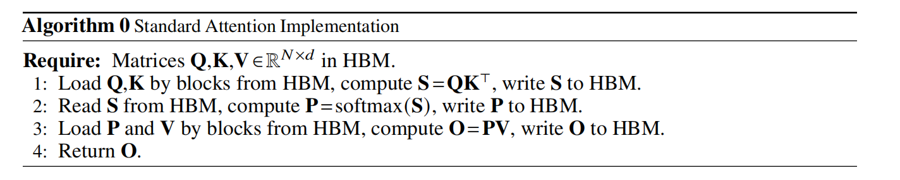

**瓶颈分析：**

- 需要在 GPU 上存储整个 QK^T 结果 → 显存开销大；
- 需要频繁访问 HBM（高带宽显存）→ 带宽受限 → 性能下降。

随着大模型和长上下文需求的快速增长（如长文本建模、代码理解和视觉 Transformer），注意力计算逐渐成为训练与推理过程中的主要性能瓶颈。

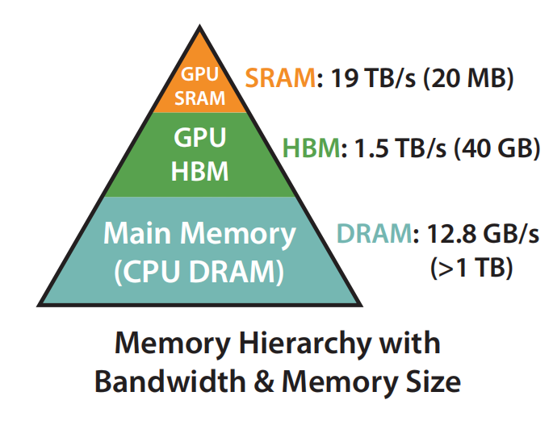

已有大量研究尝试通过稀疏化、低秩近似或核方法等方式降低计算复杂度，但这些方法大多侧重于减少算术运算量（FLOPs），而忽略了现代 GPU 架构中显存访问（HBM IO）对性能的主导作用。实际上，自注意力的 softmax、mask 与 dropout 操作在很大程度上是 **memory-bound**，显存带宽往往成为限制整体性能的关键因素。

在此背景下，FlashAttention 提出了一种 **IO-aware 的精确注意力计算方法**，从显存访问角度重新审视并优化自注意力计算流程。

------

## 二、要解决的核心问题（Problem Definition）

FlashAttention 旨在解决以下核心问题：

1. **如何在不引入近似误差的前提下，避免显式存储 $$N \times N$$ 的注意力矩阵？**
2. **如何在保持 softmax 数值稳定性的同时，对注意力计算进行分块（blocking）处理？**
3. **在不保存中间注意力矩阵的情况下，如何高效完成反向传播计算？**

换言之，论文的目标是：

> 在保证 Exact Attention 数值等价性的前提下，通过减少显存 IO 开销，实现更快、更节省显存的自注意力计算。

------

## 三、关键技术与方法分析（Key Technical Ideas）

FlashAttention 的核心思想并非减少计算量，而是通过 **减少对高带宽显存（HBM）的读写次数**，将关键计算尽可能放在 GPU 片上高速存储（SRAM）中完成。

其主要策略包括：

- 对 Q,K,V 进行分块加载（tiling）
- 在 SRAM 中完成 softmax 的局部计算
- 不显式存储注意力矩阵，仅维护必要的统计量

### 3.1 分块

将输入矩阵按行和列分块：

- $$Q_i \in \mathbb{R}^{B_r \times d}$$
- $$K_j, V_j \in \mathbb{R}^{B_c \times d}$$

对应的局部注意力得分为：

$$S_{ij} = Q_i K_j^\top$$

每次仅将当前所需的块加载至 SRAM，从而避免全量矩阵的显存访问。

### 3.2 在线softmax

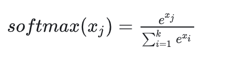

softmax操作是row-wise的，即每行都算一次softmax，所以需要用到平铺算法来分块计算softmax。

原始softmax数值不稳定，为了数值稳定性，FlashAttention采用safe softmax，向量 ∈ R 的safe softmax 计算如下：

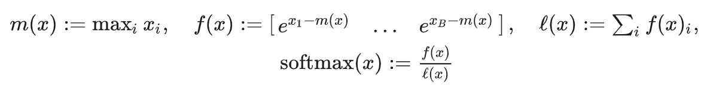

 同理，则$$ x = [x^{(1)}    x^{(2)}] $$的softmax也可以通过分解计算：

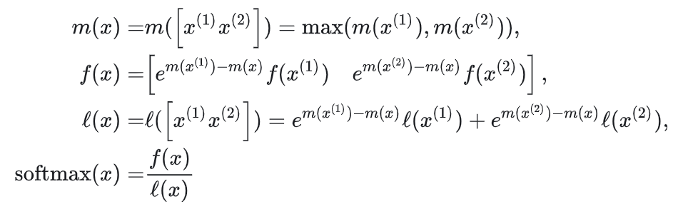

为了支持分块计算，FlashAttention 使用在线 softmax 技术。对于第 i 个 Query block，维护其行最大值 $$m_i$$ 和归一化因子 $$\ell_i$$。当处理新的 Key block 时，更新规则为：

$$m_i^{\text{new}} = \max\left(m_i, \tilde m_{ij}\right)$$

$$l_i^{\text{new}} = e^{m_i - m_i^{\text{new}}} \ell_i + e^{\tilde m_{ij} - m_i^{\text{new}}} \tilde \ell_{ij}$$

其中 $$m_{ij}$$ 和 $$\tilde \ell_{ij}$$分别表示当前块的局部最大值和归一化因子。

### 3.3 输出的增量更新

在完成 softmax 更新的同时，FlashAttention 直接累加输出：
$$
O_i \leftarrow \frac{ e^{m_i - m_i^{\text{new}}} \ell_i O_i + e^{\tilde m_{ij} - m_i^{\text{new}}} \tilde P_{ij} V_j }{ \ell_i^{\text{new}} }
$$

该过程避免了显式构造注意力概率矩阵，实现了 **边计算、边归约、边输出**。

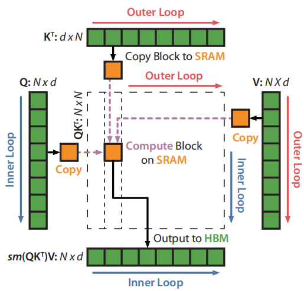

## 四、优点和局限性

### 4.1 主要优点

##### 1. 在不做近似的前提下显著加速 Attention

FlashAttention 的一个核心优势是：
 **它计算的是 Exact Attention，而不是近似 Attention**。

- 数值结果与标准 softmax attention 完全一致
- 不引入精度损失或模型行为变化
- 可直接替换现有 Transformer 中的 Attention 模块

👉 这使得 FlashAttention **在工业界落地成本极低**，不需要重新调参或重新训练模型。

------

##### 2. 显著降低显存占用，支持更长上下文

标准 Attention 需要显式存储 $$N \times N$$ 的注意力矩阵，显存复杂度为 $$O(N^2)$$。

FlashAttention 通过分块计算和在线 softmax：

- 不存储注意力矩阵
- 只保存必要的中间统计量

显存复杂度降为：

- **$$O(N)$$**

👉 实际效果是：

- 可以在相同显存条件下处理 **更长序列**
- 为长上下文语言模型和大规模 Transformer 提供了关键基础算子

------

##### 3. 真正解决了 Attention 的“性能瓶颈”

以往很多工作：

- 理论上降低了计算复杂度
- 但在 GPU 上 **wall-clock time 并没有明显改善**

FlashAttention 的不同之处在于：

- **直接针对显存 IO（HBM 访问）进行优化**
- 把计算尽量放在 GPU 片上 SRAM 中完成

👉 这使得 FlashAttention 在真实硬件上取得了：

- 显著的训练与推理速度提升
- 明确、可复现的性能收益

#### 4.2主要局限性（Limitations）

##### 1. 实现复杂度极高，难以手工维护

FlashAttention 的性能依赖于：

- 高度定制的 CUDA kernel
- 精细的 block size 和内存布局设计

这导致：

- 实现难度远高于普通 Attention
- 可读性和可维护性较差
- 对研究者和工程人员的门槛较高

👉 对非 CUDA 专业背景的研究者不够友好。

------

##### 2. 性能高度依赖硬件特性

FlashAttention 的加速效果与以下因素强相关：

- GPU 片上 SRAM 容量
- 内存层级结构
- warp / SM 调度机制

因此：

- 在老旧 GPU 或非 NVIDIA 架构上，优势可能不明显
- 跨硬件平台移植成本较高

------

##### 3. 并未改变 Attention 的计算复杂度下界

尽管显存效率大幅提升，FlashAttention 仍然需要：

- 对每个 Query–Key 对进行点积计算

也就是说：

- **计算复杂度仍为 O(N2)O(N^2)O(N2)**

👉 对于极长序列（如百万级 token），FlashAttention 本身并不能从根本上解决可扩展性问题。

------

##### 4. 主要优化 Attention 模块，覆盖范围有限

FlashAttention 只加速：

- Attention 中的 softmax 与矩阵乘法

但在大模型中：

- FFN
- LayerNorm
- Embedding
- MoE 路由

同样是显存和计算瓶颈。

👉 单靠 FlashAttention 还不足以解决整个 Transformer 的性能问题。

------

### 五、未来发展方向（Future Directions）

#### 1. 从 Attention 到“全模型 IO-Aware 设计”

FlashAttention 展示了一个重要趋势：

> **性能瓶颈正在从计算转向显存 IO**

未来可能的方向是：

- 将 IO-aware 思想推广到 FFN、LayerNorm、Embedding 等模块
- 从单一算子优化，走向 **全模型级别的 IO 优化**

------

#### 2. 自动化与编译器支持

目前 FlashAttention 的高性能依赖人工设计 CUDA kernel。

未来方向包括：

- 利用 Triton、MLIR、Inductor 等编译技术
- 自动生成 IO-aware 的高性能算子
- 降低开发和维护成本

👉 这是从“专家手工优化”走向“系统自动优化”的关键一步。

------

#### 3. 与结构性方法结合以突破规模限制

FlashAttention 解决的是 IO 问题，而不是算法复杂度问题。

未来可以考虑：

- 与稀疏 Attention
- 滑动窗口 Attention
- 检索增强 Attention

结合，在：

- 算法层面降低计算量
- 算子层面减少显存访问

实现双重加速。

### 实验部分

### 一、Attention 算子级实验（Microbenchmark）

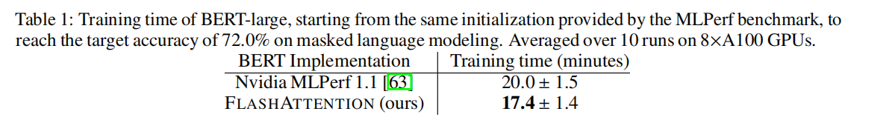

这是您提供的图表（Table 1）的完整中文翻译：

------

**表 1：BERT-large 模型的训练时间对比**

（从 MLPerf 基准测试提供的相同初始化点开始训练，以达到掩码语言建模任务 72.0% 的目标准确率。结果基于 8 块 A100 GPU 上运行 10 次的平均值。）

| BERT 实现                       | 训练时间 (分钟) |
| ------------------------------- | --------------- |
| Nvidia MLPerf 1.1 [63]          | 20.0 ± 1.5      |
| **FLASHATTENTION (我们的实现)** | **17.4 ± 1.4**  |

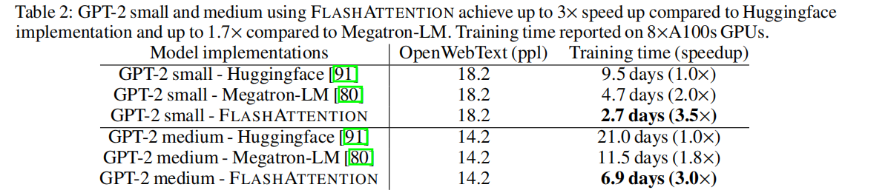

表 2：使用 FlashAttention 的 GPT-2 模型训练加速对比

（在 8 块 A100 GPU 上，使用 FlashAttention 的 GPT-2 small 和 medium 模型，相比 Huggingface 实现实现了最高 3 倍的加速，相比 Megatron-LM 实现了最高 1.7 倍的加速。）

| 模型实现                          | OpenWebText 困惑度 | 训练时间（加速倍数） |
| --------------------------------- | ------------------ | -------------------- |
| GPT-2 small - Huggingface [91]    | 18.2               | 9.5 天 (1.0倍)       |
| GPT-2 small - Megatron-LM [80]    | 18.2               | 4.7 天 (2.0倍)       |
| **GPT-2 small - FlashAttention**  | **18.2**           | **2.7 天 (3.5倍)**   |
| GPT-2 medium - Huggingface [91]   | 14.2               | 21.0 天 (1.0倍)      |
| GPT-2 medium - Megatron-LM [80]   | 14.2               | 11.5 天 (1.8倍)      |
| **GPT-2 medium - FlashAttention** | **14.2**           | **6.9 天 (3.0倍)**   |

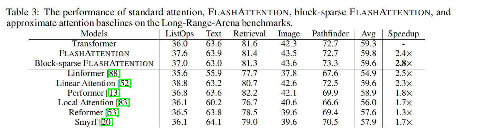

表 3：标准注意力、FLASHATTENTION、块稀疏 FLASHATTENTION 以及各近似注意力基线方法在长序列竞技场基准测试上的性能

| 模型                  | ListOps | Text | Retrieval | Image | Pathfinder | 平均 | 加速倍数 |
| --------------------- | ------- | ---- | --------- | ----- | ---------- | ---- | -------- |
| Transformer           | 36.0    | 63.6 | 81.6      | 42.3  | 72.7       | 59.3 | -        |
| FLASHATTENTION        | 37.6    | 63.9 | 81.4      | 43.5  | 72.7       | 59.8 | 2.4×     |
| 块稀疏 FLASHATTENTION | 37.0    | 63.0 | 81.3      | 43.6  | 73.3       | 59.6 | 2.8×     |
| Linformer [88]        | 35.6    | 55.9 | 77.7      | 37.8  | 67.6       | 54.9 | 2.5×     |
| Linear Attention [52] | 38.8    | 63.2 | 80.7      | 42.6  | 72.5       | 59.6 | 2.3×     |
| Performer [13]        | 36.8    | 63.6 | 82.2      | 42.1  | 69.9       | 58.9 | 1.8×     |
| Local Attention [83]  | 36.1    | 60.2 | 76.7      | 40.6  | 66.6       | 56.0 | 1.7×     |
| Reformer [53]         | 36.5    | 63.8 | 78.5      | 39.6  | 69.4       | 57.6 | 1.3×     |
| Smyrf [20]            | 36.1    | 64.1 | 79.0      | 39.6  | 70.5       | 57.9 | 1.7×     |

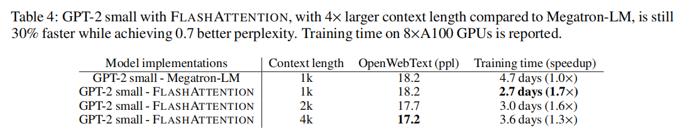

表 4：采用 FLASHATTENTION 的 GPT-2 small 模型，在上下文长度扩大 4 倍的情况下，仍比 Megatron-LM 快 30%，且困惑度降低了 0.7。训练时间基于 8 块 A100 GPU 测得。

| 模型实现                         | 上下文长度 | OpenWebText (困惑度) | 训练时间 (加速倍数) |
| -------------------------------- | ---------- | -------------------- | ------------------- |
| GPT-2 small - Megatron-LM        | 1k         | 18.2                 | 4.7 天 (1.0×)       |
| GPT-2 small - FLASHATTENTION     | 1k         | 18.2                 | 2.7 天 (1.7×)       |
| **GPT-2 small - FLASHATTENTION** | **2k**     | **17.7**             | **3.0 天 (1.6×)**   |
| **GPT-2 small - FLASHATTENTION** | **4k**     | **17.2**             | **3.6 天 (1.3×)**   |

### 实验目的

验证在**单个 Attention 算子层面**，FlashAttention 是否真的能：

- 减少运行时间
- 缓解随着序列长度增长带来的性能退化

------

### 实验设计要点

- 固定隐藏维度和 batch size
- 逐步增大 sequence length
- 对比：
  - 标准 Attention 实现
  - FlashAttention

测试内容包括：

- Forward
- Backward
- Forward + Backward

------

### 实验结论

实验结果表明：

- 随着序列长度增加，**标准 Attention 的运行时间快速增长**
- FlashAttention 的运行时间增长明显更慢
- 在中长序列（如 1k、2k、4k tokens）下，FlashAttention 能取得**显著加速**

其根本原因在于：

> FlashAttention 避免了显式构造注意力矩阵，大幅减少了对 HBM 的读写次数，使 Attention 从强 memory-bound 操作向更接近 compute-bound 转变。

------

### 你在组会上可以强调的一句话

> 在算子级别实验中，FlashAttention 的加速效果会随着序列长度增加而更加明显，说明其优势来自 IO 行为的根本改变，而不是常数级优化。

------

## 二、显存占用实验（Memory Usage）

### 实验目的

验证 FlashAttention 是否真的将 Attention 的显存复杂度：

- 从标准 Attention 的 O(N2)O(N^2)O(N2)
- 降低到 O(N)O(N)O(N)

------

### 实验设计要点

- 测量 GPU 峰值显存占用
- 对比不同 sequence length 下：
  - 标准 Attention
  - FlashAttention

------

### 实验结论

实验结果清楚表明：

- 标准 Attention 的显存占用随着序列长度呈二次增长
- FlashAttention 的显存占用几乎呈线性增长

这意味着：

> 在相同的 GPU 显存条件下，FlashAttention 能支持远长于标准 Attention 的上下文长度，而标准 Attention 很快会因显存不足而无法运行。

------

### 关键解读（非常重要）

论文强调，这一结果的意义不只是“省显存”，而是：

> **决定了模型是否能够训练或推理更长序列。**

这是 FlashAttention 能成为长上下文 Transformer 关键基础算子的根本原因。

------

## 三、端到端 Transformer 训练实验（End-to-End Training）

### 实验目的

验证 FlashAttention 是否：

- 只在算子层面有效
- 还是能在真实 Transformer 训练中带来整体收益

------

### 实验设置

作者将 FlashAttention 直接替换标准 Attention，用于：

- Transformer Encoder / Decoder
- BERT-like 模型
- GPT-like 自回归模型

其他设置保持不变。

------

### 实验结论

实验结果表明：

1. **FlashAttention 可以作为标准 Attention 的直接替换**
2. 在端到端训练中：
   - 每 step 训练时间减少
   - 吞吐量（tokens/s）明显提升
3. 模型的：
   - 输出结果
   - 梯度
   - 收敛行为

均与标准 Attention **完全一致**

------

### 论文强调的关键点（建议原话转述）

> FlashAttention 在不引入任何近似误差的情况下，实现了训练速度的提升。

这直接证明：

- FlashAttention 是 **Exact Attention**
- 加速来源是系统层面的 IO 优化，而非模型改动

------

## 四、长序列扩展性实验（Long Sequence Scaling）

### 实验动机

Attention 在长序列场景下是最极端、也是最容易暴露瓶颈的情况：

- 计算量大
- 显存访问密集
- 容易完全被 IO 限制

------

### 实验结论

实验显示：

- 序列越长，FlashAttention 相对标准 Attention 的优势越明显
- FlashAttention 在长序列场景下能够更充分地利用 GPU 计算单元

论文总结认为：

> FlashAttention 显著缓解了 Attention 在长序列下的 IO 瓶颈，使其扩展性大幅提升。

------

## 五、作者对实验结果的总体解读

论文在实验部分反复强调三点：

1. FlashAttention 的优势来自 **显存 IO 行为的根本改变**
2. 加速效果在：
   - forward
   - backward
   - 端到端训练
     中都成立
3. 该方法不依赖：
   - 近似
   - 稀疏化
   - 改变 Attention 结构

# Flashattention2

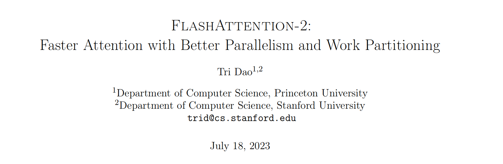

FLOPs：浮点运算次数

FP16：用16位（2字节）存储一个数字，其中1位表示符号，5位表示指数，10位表示尾数。

FP32：用32位（4字节）存储一个数字，其中1位表示符号，8位表示指数，23位表示尾数。

BF16：使用16位存储，但分配方式不同：1位符号，8位指数，7位尾数。

Kernel：一个由开发者编写、在GPU上启动并指挥成千上万个线程同时执行同一段计算任务的程序

#### 对Flashattention1的改进：

​	1.减少非矩阵乘法（non-matmul）的浮点运算次数

​	2.在序列长度维度上进行并行化

​	3.优化线程块内的工作划分：避免“Split-K”方案，减少通信

### 1.减少非矩阵乘法（non-matmul）的浮点运算次数

​	现代GPU有针对矩阵乘法专用的计算单元，效率很高。

​	以A100 GPU为例，其FP16/BF16矩阵乘法的最大理论吞吐量为312 TFLOPs/s，但FP32非矩阵乘法仅有19.5 TFLOPs/s，即每个no-matmul FLOP比matmul FLOP昂贵16倍。

​	为了确保高吞吐量（例如超过最大理论TFLOPs/s的50％），我们希望尽可能将时间花在matmul FLOPs上。

#### 	1.1处理第一个块时，暂不进行局部归一化

​		FlashAttention-1 的做法（立即归一化）：

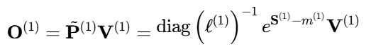

​		FlashAttention-2 的优化（推迟归一化，维护未缩放输出）：

#### 	1.2 迭代更新时，修正因最大值变化带来的尺度差异

​		FlashAttention-1 的更新（需对旧结果进行两次缩放）：

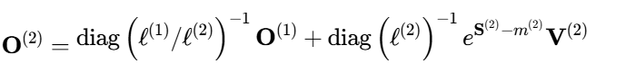

​		FlashAttention-2 的更新（只需基于最大值变化进行单次缩放）：

#### 	1.3 循环结束后，执行一次性最终归一化

​		FlashAttention-2 在最后一步统一应用归一化因子：

​		FlashAttention-2 通过在整个循环中维护未缩放的中间输出，将复杂的逐块归一化与重缩放操作，简化为仅基于最大值 m(i)的尺度修正，并将所有行的归一化操作推迟到最后一步统一完成。这显著减少了非矩阵乘法运算（如除法、缩放）的次数，从而提升了计算效率。

### 2.Thread Block（线程块）划分改进（Work Partitioning）

#### 	2.1 GPU基础概念

​		GPU 是高度并行的处理器，其核心由多个 Streaming Multiprocessors（SM）组成，每个 SM 又包含多个 CUDA 核心。GPU 的并行粒度如下：

- 线程（Thread）：最小的执行单位；

- 线程束（Warp）：32 个线程组成一个 warp，是 GPU 并行调度的基本单位；

- 线程块（Thread Block）：由多个 warp 构成；

- 网格（Grid）：包含所有线程块。

  

​		每个 warp 的 32 个线程会被同步执行同一段指令（SIMD 模式），如果 warp 内线程分支不同，则会出现 线程发散，降低效率。

​		因此，高效利用 warp 的并行能力，是优化 GPU kernel 的关键。

​		FlashAttention 2 的一个核心优化就是：提升 warp 的利用率，使得 32 个线程同时高效工作，避免资源浪费。

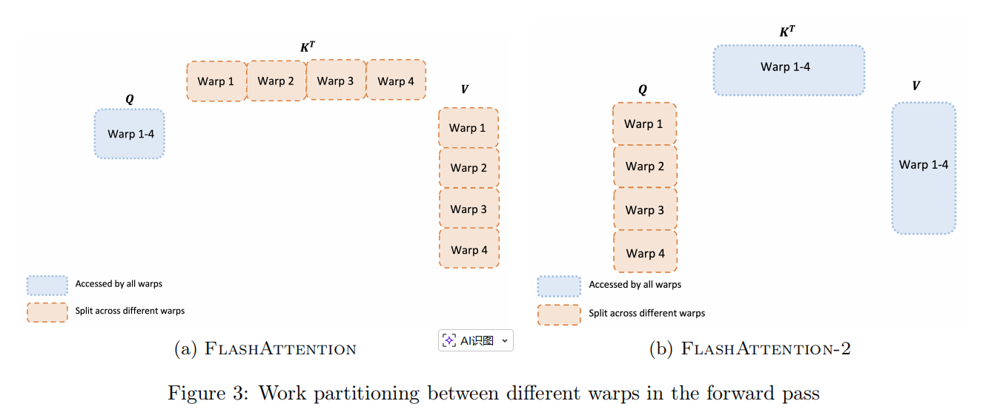

FlashAttention forward pass: 

​	外循环对K,V在输入序列N上遍历，内循环对Q在N上遍历。对于每个block，FlashAttention将K和V分别分为4个warp，并且所有warp都可以访问Q。K的warp乘以Q得到S的一部分$$S_{ij}$$，然后$$S_{ij}$$经过局部softmax后还需要乘以V的一部分得到$$O_i$$。然而，每次外循环j++都需要更新一遍$$O_i$$（对上一次$$O_i$$先rescale再加上当前值），这就导致每个warp需要从HBM频繁读写$$O_i$$以累加出总结果。这种方式被称为“split-K”方案，是非常低效的，因为所有warp都需要从HBM频繁读写中间结果（$$Q_i,O_i,m_i,l_i$$）。

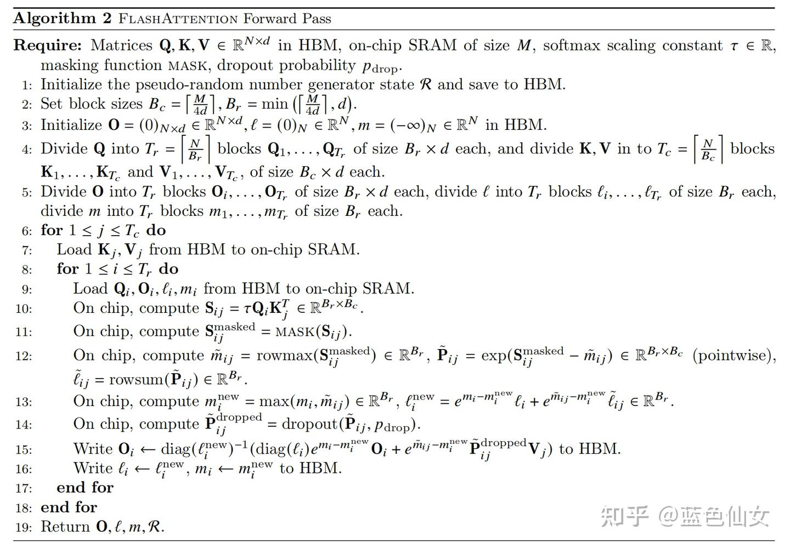

FlashAttention-2 forward pass:

​	FlashAttention-2将Q移到了外循环i，K,V移到了内循环j，并将Q分为4个warp，所有warp都可以访问K和V。这样做的好处是，原来FlashAttention每次内循环i++会导致$$O_i$$也变换（而$$O_i$$需要通过HBM读写），现在每次内循环j++处理的都是$$O_i$$，此时$$O_i$$是存储在SRAM上的，代价远小于HBM。

### 3.并行化

​	FlashAttention在batch（批次大小）和heads（注意力头数量）两个维度上进行了并行化：使用一个线程块来处理一个注意力头，总共需要线程块的数量等于batch size × number of heads。每个线程块被调到到一个SM上运行，例如A100 GPU上有108个SMs。当block数量很大时（例如≥80），这种调度方式是高效的，因为几乎可以有效利用GPU上所有计算资源。

​	但是在处理长序列输入时，由于单样本内存占用剧增，不得不减小批次大小，这直接导致可并行任务数锐减。GPU上许多计算核心会因“无任务可分”而闲置，造成低占用率，计算速度下降。因此，FlashAttention-2还在序列长度这一维度上进行并行化，显著提升了计算速度。此外，当batch size和head数量较小时，在序列长度上增加并行性有助于提高GPU占用率。

​	Forward pass. FlashAttention算法有两个循环，K,V在外循环，Q,O在内循环。FlashAttention-2将Q移到了外循环i；K,V移到了内循环j，由于改进了算法使得warps之间不再需要相互通信去处理$$Q_i$$，所以外循环可以放在不同的线程块上。

具体来说，在算法中，这体现在对输出矩阵`O`的行进行划分：在前向传播中，每个工作单元（线程块）负责计算最终输出`O`的一个连续的行块。这对应算法1中，外层循环 `for 1 ≤ i ≤ Tr`（遍历`Q`的行块）可以被并行执行。

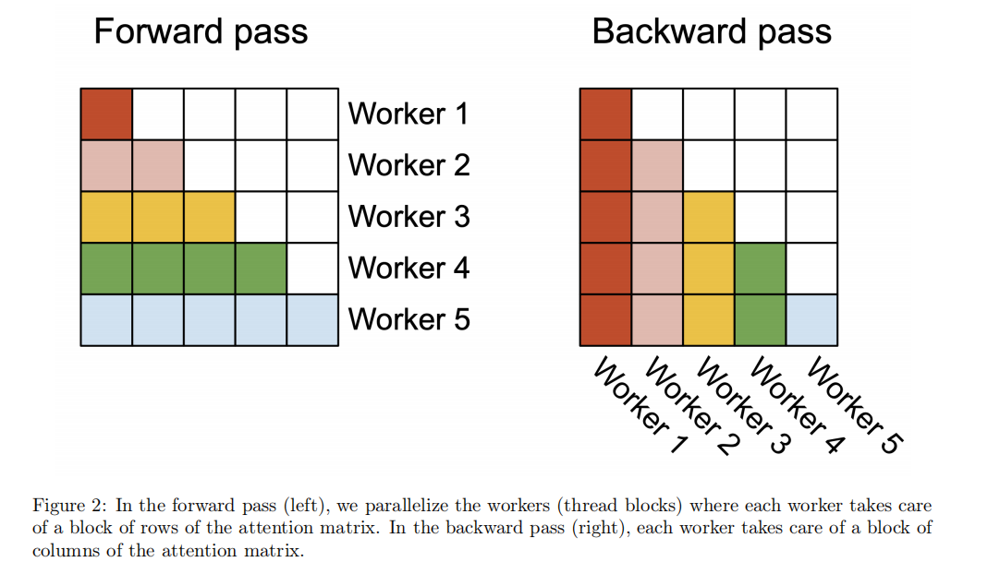

线上服务负载，批量负载

线性注意力

TTT-layer

大模型推理，隐私保护，中间层在云端

全动态加密

找新的论文，25或26年初

扩散模型

扩散模型文本生成

# Flashattention2

FLOPs：浮点运算次数

FP16：用16位（2字节）存储一个数字，其中1位表示符号，5位表示指数，10位表示尾数。

FP32：用32位（4字节）存储一个数字，其中1位表示符号，8位表示指数，23位表示尾数。

BF16：使用16位存储，但分配方式不同：1位符号，8位指数，7位尾数。

Kernel：一个由开发者编写、在GPU上启动并指挥成千上万个线程同时执行同一段计算任务的程序

#### 对Flashattention1的改进：

​	1.减少非矩阵乘法（non-matmul）的浮点运算次数

​	2.在序列长度维度上进行并行化

​	3.优化线程块内的工作划分：避免“Split-K”方案，减少通信

### 1.减少非矩阵乘法（non-matmul）的浮点运算次数

​	现代GPU有针对矩阵乘法专用的计算单元，效率很高。

​	以A100 GPU为例，其FP16/BF16矩阵乘法的最大理论吞吐量为312 TFLOPs/s，但FP32非矩阵乘法仅有19.5 TFLOPs/s，即每个no-matmul FLOP比matmul FLOP昂贵16倍。

​	为了确保高吞吐量（例如超过最大理论TFLOPs/s的50％），我们希望尽可能将时间花在matmul FLOPs上。

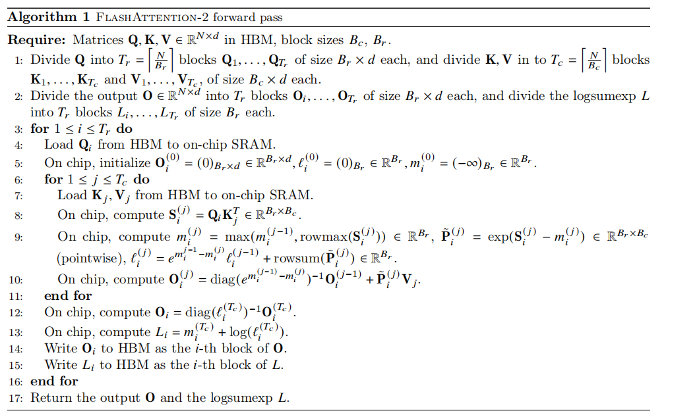

#### 	1.1处理第一个块时，暂不进行局部归一化

​		FlashAttention-1 的做法（立即归一化）：

​		FlashAttention-2 的优化（推迟归一化，维护未缩放输出）：

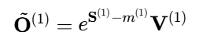

#### 	1.2 迭代更新时，修正因最大值变化带来的尺度差异

​		FlashAttention-1 的更新（需对旧结果进行两次缩放）：

​		FlashAttention-2 的更新（只需基于最大值变化进行单次缩放）：

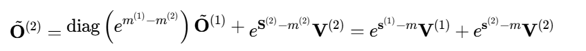

#### 	1.3 循环结束后，执行一次性最终归一化

​		FlashAttention-2 在最后一步统一应用归一化因子：

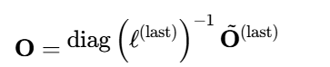

​		FlashAttention-2 通过在整个循环中维护未缩放的中间输出，将复杂的逐块归一化与重缩放操作，简化为仅基于最大值 m(i)的尺度修正，并将所有行的归一化操作推迟到最后一步统一完成。这显著减少了非矩阵乘法运算（如除法、缩放）的次数，从而提升了计算效率。

### 2.Thread Block（线程块）划分改进（Work Partitioning）

#### 	2.1 GPU基础概念

​		GPU 是高度并行的处理器，其核心由多个 Streaming Multiprocessors（SM）组成，每个 SM 又包含多个 CUDA 核心。GPU 的并行粒度如下：

- 线程（Thread）：最小的执行单位；

- 线程束（Warp）：32 个线程组成一个 warp，是 GPU 并行调度的基本单位；

- 线程块（Thread Block）：由多个 warp 构成；

- 网格（Grid）：包含所有线程块。

  

​		每个 warp 的 32 个线程会被同步执行同一段指令（SIMD 模式），如果 warp 内线程分支不同，则会出现线程发散，降低效率。

​		因此，高效利用 warp 的并行能力，是优化 GPU kernel 的关键。

​		FlashAttention 2 的一个核心优化就是：提升 warp 的利用率，使得 32 个线程同时高效工作，避免资源浪费。

FlashAttention forward pass: 

​	外循环对K,V在输入序列N上遍历，内循环对Q在N上遍历。对于每个block，FlashAttention将K和V分别分为4个warp，并且所有warp都可以访问Q。K的warp乘以Q得到S的一部分$$S_{ij}$$，然后$$S_{ij}$$经过局部softmax后还需要乘以V的一部分得到$$O_i$$。然而，每次外循环j++都需要更新一遍$$O_i$$（对上一次$$O_i$$先rescale再加上当前值），这就导致每个warp需要从HBM频繁读写$$O_i$$以累加出总结果。这种方式被称为“split-K”方案，是非常低效的，因为所有warp都需要从HBM频繁读写中间结果（$$Q_i,O_i,m_i,l_i$$）。

FlashAttention-2 forward pass:

​	FlashAttention-2将Q移到了外循环i，K,V移到了内循环j，并将Q分为4个warp，所有warp都可以访问K和V。这样做的好处是，原来FlashAttention每次内循环i++会导致$$O_i$$也变换（而$$O_i$$需要通过HBM读写），现在每次内循环j++处理的都是$$O_i$$，此时$$O_i$$是存储在SRAM上的，代价远小于HBM。

### 3.并行化

​	FlashAttention在batch（批次大小）和heads（注意力头数量）两个维度上进行了并行化：使用一个线程块来处理一个注意力头，总共需要线程块的数量等于batch size × number of heads。每个线程块被调到到一个SM上运行，例如A100 GPU上有108个SMs。当block数量很大时（例如≥80），这种调度方式是高效的，因为几乎可以有效利用GPU上所有计算资源。

​	但是在处理长序列输入时，由于单样本内存占用剧增，不得不减小批次大小，这直接导致可并行任务数锐减。GPU上许多计算核心会因“无任务可分”而闲置，造成低占用率，计算速度下降。因此，FlashAttention-2还在序列长度这一维度上进行并行化，显著提升了计算速度。此外，当batch size和head数量较小时，在序列长度上增加并行性有助于提高GPU占用率。

具体来说，在算法中，这体现在对输出矩阵`O`的行进行划分：在前向传播中，每个工作单元（线程块）负责计算最终输出`O`的一个连续的行块。这对应算法中，外层循环 `for 1 ≤ i ≤ Tr`（遍历`Q`的行块）可以被并行执行。

## 实验部分

### 1.基准测试与性能比较

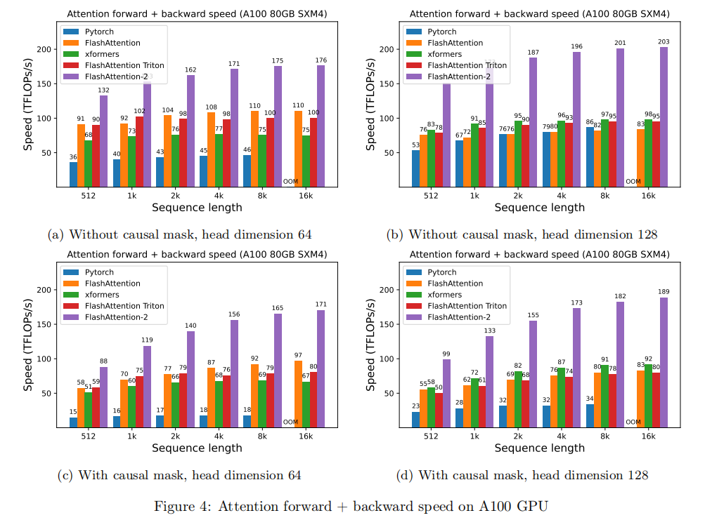

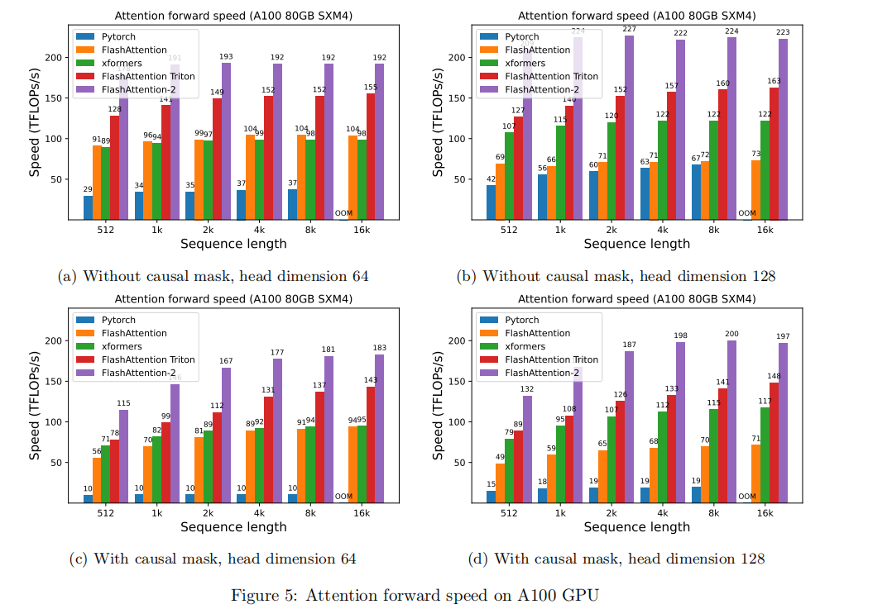

使用的硬件：A100 80GB SXM4 GPU。

测试了不同序列长度：512, 1k, 2k, 4k, 8k, 16k。

使用的头维度有64和128。

对比了前向传播和反向传播的计算速度。

实验结果:

FlashAttention-2比FlashAttention快1.7–3倍，比Triton版本的FlashAttention快1.3–2.5倍，比标准的PyTorch实现快最多10倍。

特别是前向传播和反向传播速度的提升，使得FlashAttention-2在各种配置下均表现出显著的加速。

### 2.端到端训练速度

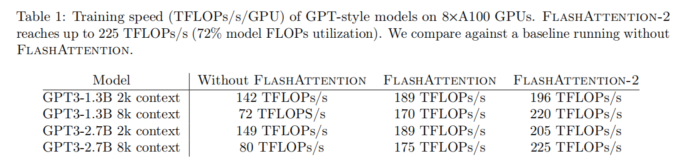

测试了使用FlashAttention-2进行端到端训练的速度，与没有使用FlashAttention的基准进行比较，并且测试了其在GPT-style模型训练中的表现。

使用的模型：1.3B和2.7B参数的GPT-style模型。

测试了序列长度为2k和8k的情况。

A100 GPU被用于训练，测量了每个GPU的训练速度，单位为TFLOPs/s。

实验结果:

FlashAttention-2相较于FlashAttention提供了1.3倍的加速，比没有使用FlashAttention的基准快2.8倍。

在A100 GPU上，FlashAttention-2达到了225 TFLOPs/s，即GPU的计算能力的72%的模型FLOPs利用率。
