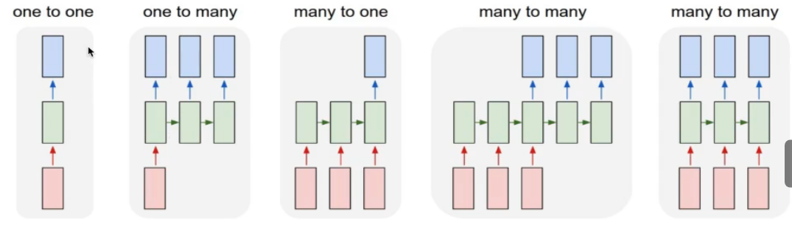
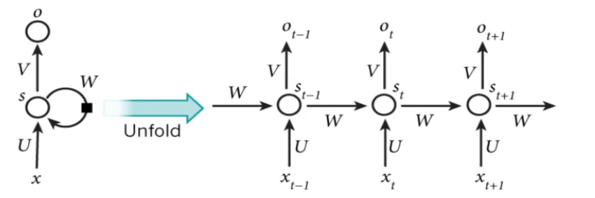
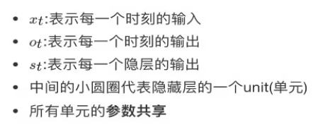
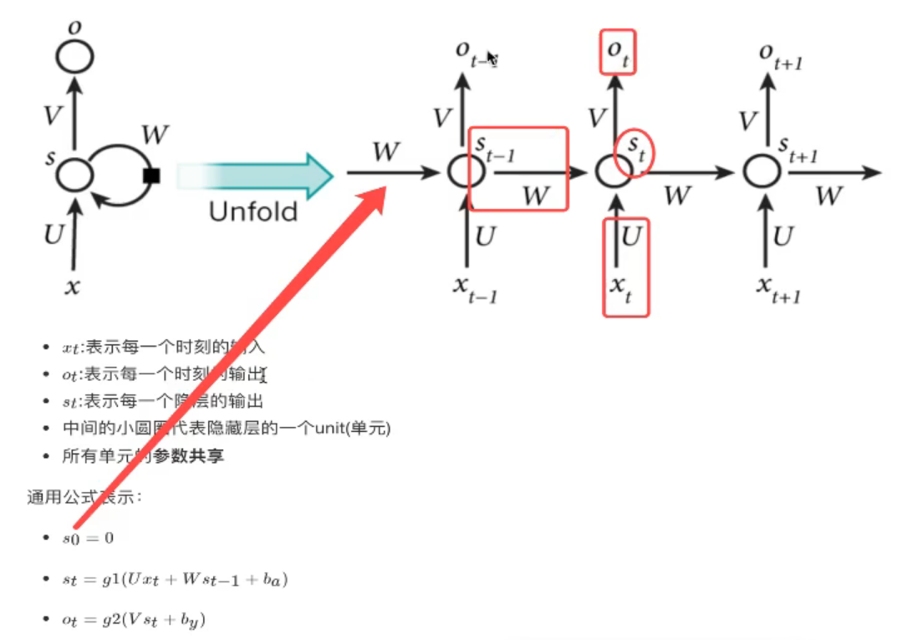
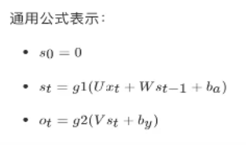
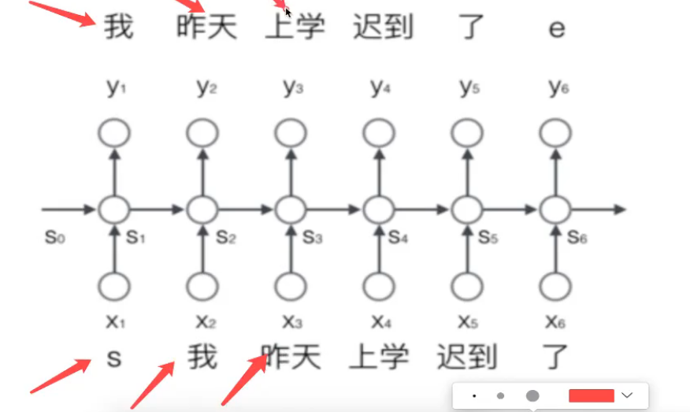
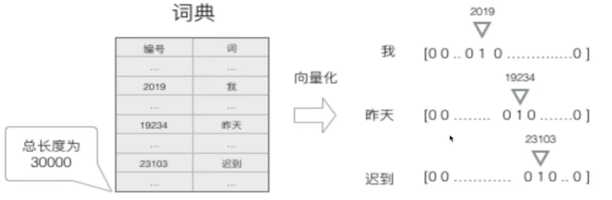

# RNN 循环神经网络

### 1.序列模型 

#### 	1.1 定义

​			通常在自然语言、音频、视频以及其他序列数据的模型

#### 	1.2 类型

​			语音识别

​			情感分类

​			机器翻译

#### 	1.3 序列模型使用CNN等神经网络效果不好原因

​			序列模型前后有很强关联性

​			序列数据输入输出长度不固定

### 2. 定义

​	是神经网络的一种。将状态在自身网络中循环传递，可以接受时间序列结构输入。

#### 	2.1 类型

​		一对一：图像分类

​		一对多：图像的文字描述

​		多对一：情感分析，分类正负面情绪

​		多对多：机器翻译

​		同步多对多：文本生成、视频每一帧的分类，也称为序列生成

#### 	2.2 基础RNN介绍

​					U,V,W是参数共享的，所有的cell都用一套

##### 		计算过程

​	g1,g2为激活函数

​			g1：tanh/relu

​			g2：sigmoid/softmax

#### 	2.3 序列生成案例

​		通常对于一个序列，给一个开始和结束的状态，start, end标志

​			s 我 昨天 上学 迟到 了 e

​		输入到网络当中的是一个个的分词结果，每一个词的输入是一个时刻

#### 	2.4 词的表示

​		对词进行向量表示：

​		建立一个包含所有序列词的词典，（包含开始和结束两个特殊词，以及没有出现过的词等），每个词在词典里有一个唯一的编号。	

​		任意一个词都可以用一个N维的one-hot向量表示。N为词典里词的个数。

​		得到了一个高维、稀疏的向量。