# skipGPT

层剪枝：除深度神经网络中的完整层（layer) 来减少模型的计算量和内存占用，同时尽量保持原模型的性能。

层：“层”通常指一个 Transformer 块（包含自注意力机制和前馈网络）。

## 引言

大模型（LLM）建立在逐层的Transformer架构之上，其中每一层由一个自注意力机制后跟一个多层感知机（MLP）组成。

它是顺序的逐层结构，并行性低。关键策略是层剪枝

剪枝两个关键方面：

​	1.水平动态：输入序列中的不同Token需要不同级别的计算量。当前的方法要么将资源分配给每层前k个最相关的Token，要么对所有Token强制执行固定的计算比例。这些僵化的方法无法适应Token的复杂性，导致效率次优。

​	引入了一种全局稀疏机制，允许计算预算灵活地分布在整个前向传播过程中。

​	2.垂直动态：每一层内的MLP和自注意力组件服务于不同的功能。每一层内的MLP和自注意力组件服务于不同的功能，然而大多数剪枝方法统一对待它们。

​	将MLP和自注意力的剪枝解耦，从而实现更具针对性和更高效的计算减少。

为了实现动态剪枝，最近的一些工作探索了自适应计算方法，这些方法在每个Transformer层引入了一个路由器。该路由器作为一个决策模块，决定在推理期间是否应该执行或跳过特定的网络单元。然而，这些方法通常采用联合训练范式，类似于专家混合（MoE），同时优化路由器和模型参数。然而，这种方法未能考虑到剪枝与预训练之间的根本区别——在剪枝的背景下，路由器从随机初始化开始，而模型参数已经通过大量的预训练收敛到最优或局部最优分布。这种不匹配可能使联合训练不稳定，并阻止动态剪枝充分发挥其潜力。

动态剪枝：自适应计算方法，在每个Transformer层引入了一个路由器，作为一个决策模块，决定在推理期间是否应该执行或跳过特定的网络单元。

## 水平动态和垂直动态的重要性

模块输入和输出之间的余弦相似度可以作为评估每个模块重要性的可靠指标。

模块产生的输出与其输入非常相似，表明变换极小。

在Token级别分析了每个模块的余弦相似度。具体来说，第i个模块在Token t处的余弦相似度$$C_{i,t}$$计算如下：

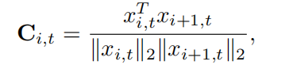

用从BookCorpus数据集中随机选择的一个句子进行案例研究，分析了LLaMA-2-7B中15个连续Token的余弦相似度分布

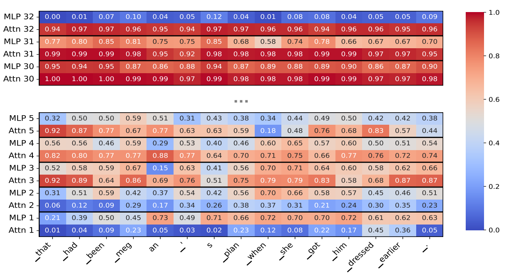

垂直动态的剪枝通常将整个Transformer层视为最小的剪枝单元，但是同一层内，注意力和MLP模块的余弦相似度分布可能存在显著差异。因此需要将注意力和MLP模块解耦。例如，在第二层中，注意力模块中大多数Token的余弦相似度范围在0.1到0.4之间，而MLP模块主要在0.4到0.7范围内。这表明，对于这一层，MLP模块几乎普遍比注意力模块更冗余。然而，在最后一层，情况完全相反：所有注意力模块的余弦相似度值都在0.9到1之间，而MLP模块则在完全不同的范围内，从0到0.2，使得MLP模块在此阶段远比注意力模块关键。这些发现揭示，即使在同一层内，注意力和MLP之间的冗余水平也可能变化，并在层间转移，这强调了将注意力和MLP模块解耦以实现更有效剪枝的必要性。

现有的动态剪枝方法在设置计算预算时也采用了这些假设：（1）重要模块的分布在所有Token上是均匀的；（2）每个Token关联着相同数量的重要模块。分析每个Token余弦相似度低于0.6的模块数量——认为这些模块是重要的。结果显示，Token"plan"与13个重要模块相关联，而"an"只有8个，证实了不同的Token需要不同级别的计算量。

## skipGPT

### 预备知识：Gumbel-Softmax、STE

离散决策不可微，无法进行基于梯度的优化。

Gumbel-Softmax分布是类别分布的连续近似，实现了可微采样。将离散样本转换为可微的连续样本，以便进行基于梯度的优化。

$$π_1,π_2,…,π_k $$表示一个k类类别分布的类别概率，Gumbel-Max选择具有最高$$ log⁡π_i+g_i $$值的类别，其中*$$g_i$$* 是来自Gumbel分布 $$Gumbel(0,1)^1 $$的独立同分布样本：

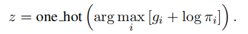

由于 argmax 是不可微的，Gumbel-Softmax用一个softmax函数替代它，产生近似类别分布的连续样本

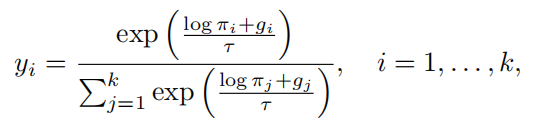

$$当 τ→0 $$（低温）：指数内部的数值会被放大，使得原本较大的 $$ log⁡π_i+g_i $$变得极大，而较小的变得极小。经过 softmax 后，最大的那个值会趋近于 1，其他值趋近于 0。此时的分布非常尖锐，几乎就是一个 one-hot 向量（即只有一个 1，其余为 0）。这对应于确定性更强的决策。

Straight-Through估计器：实现了离散采样，同时保留了反向传播的可微性。前向传播时走硬性决策，反向传播时假装走软性概率。

前向传播中，我们使用Gumbel-Softmax生成连续样本。为了离散化它们，我们应用 argmax，但在反向传播中，梯度如同使用连续近似来计算。这是通过以下方式实现的：

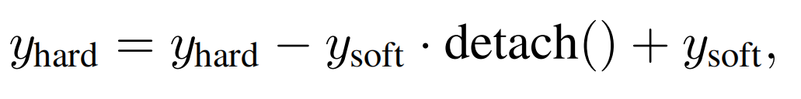

### 稀疏性

稀疏性：在一次前向传播中跳过的模块计算（注意力或MLP）的比例

稀疏性是通过动态路由实现的，在每次前向传播中，只有一部分模块被选中进行计算。

我们允许计算负载在宽度（每层参与计算的Token数量）和高度（每个Token参与计算的模块数量）上动态分配。

### 路由实现

在每个单独的模块之前分配一个路由器。

Token有两条计算路径可以选择，（1）自注意力（对于注意力路由器）或FFN模块（对于FFN路由器），（2）残差连接。后者计算成本低，产生的输出完全由输入决定，而前者则产生高昂的计算成本。

一个Token $$x_l$$在进入第l个Transformer模块 $$f_l$$（自注意力或FFN）前，先经过一个路由器函数，这是一个简单的线性投影，产生一个二维向量表示的类别分布 $$r_l=W_g^Tx_l∈R^2$$，其中第一个元素表示跳过该模块的概率，第二个元素表示执行该模块的概率。

一旦获得这个类别分布，一个自然的策略是Top-1路由。具体来说，我们有：

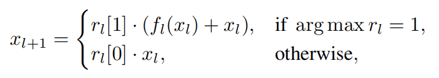

公式根据 $$r_l$$中哪个元素最大（即概率最高的决策）来选择执行哪条路径：

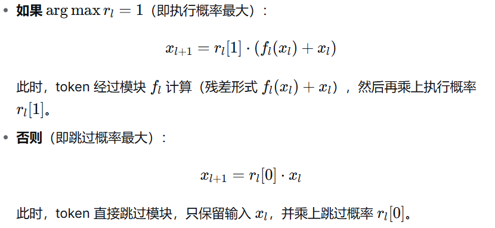

虽然 ⁡argmax 本身不可微，但这里在计算最终输出时乘上了对应的概率值。这样，损失对$$r_l$$的梯度就可以通过这两个系数反向传播，从而更新路由器的参数$$W_g$$。也就是说，即便决策是离散的（通过 argmax 硬选），但输出是概率加权的结果，保持了可微性。

无法精确控制每个模块是否真的被完全跳过，因为输出中总是混入了概率权重，无法达到严格的 0/1 二值状态。虽然可微，但无法精确满足预设的稀疏度目标（比如希望正好跳过 40% 的模块）。

通过利用Gumbel-Softmax和ST Gumbel估计器解决这个问题

在对$$r_l$$应用Gumbel-Softmax和ST Gumbel估计器后，我们得到一个one-hot向量 $$g_l∈\{0,1\}^2$$。因此，下一个模块的输入计算如下：

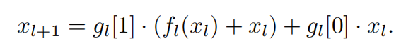

在前向传播中，路由器做出硬性决策，要么执行（1）要么跳过（0）。在反向传播中，梯度使用软概率反向传播。

### 损失函数

稀疏度r：

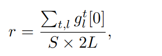

其中t是Token索引，l代表模块索引，L是LLM的总层数，S表示序列长度。为了满足不同的计算需求，我们引入了一个稀疏度正则化项：

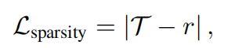

其中 ∣⋅∣ 表示绝对值，$$T$$ 是用户定义的目标稀疏度。

总的损失函数则由下式给出：

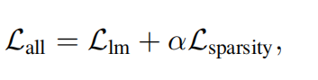

其中 $$L_{lm}$$ 是标准的语言建模损失，代表平均预测下一个Token的负对数似然。超参数 *α* 控制稀疏惩罚在总损失函数中的强度。

### 两阶段训练范式

由于路由器从随机初始化开始，而LLM已经预训练，直接训练可能导致不稳定且次优的剪枝决策。

初始阶段：路由器调优，其他模型参数冻结。在每个模块前添加一个轻量级的线性层，所有路由器参数合计仅占LLaMA2-7B总参数的0.007%。

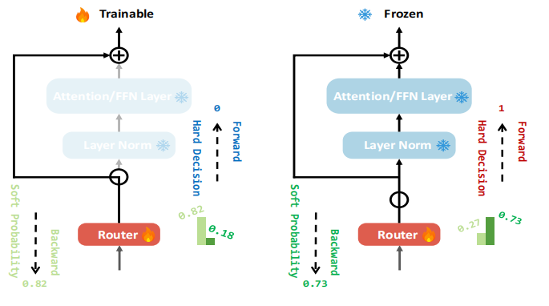

LoRA微调阶段（可选）：冻结已经训练好的路由器，使用 LoRA 技术对 LLM 本身的参数进行微调。LoRA能够以最小的计算开销实现对LLM的高效精调。

## 实验

模型：实验选用了当时极具代表性的开源大语言模型，以验证方法的通用性：

- LLaMA2-7B
- LLaMA2-13B
- LLaMA3.1-8B

训练数据：使用 RedPajama-Data-1T-Sample 数据集，包含 85 万个样本（10 亿 token），每个样本截断至 4096 token。该数据集同时用于静态方法的校准和动态方法的训练。

评估基准：

- 常识推理：BoolQ、PIQA、HellaSwag、WinoGrande、ARC-easy、ARC-challenge、OpenbookQA (OBQA)
- 语言建模：WikiText2 (WT2) 和 PTB 的零样本困惑度 (PPL)

##### 训练细节

- 训练步骤：10,000 步，批量大小 16。
- 第一阶段 (路由器调优)：学习率 $$2e^{-3}$$，Gumbel-Softmax 温度 $$τ$$ 从 5 线性退火到 1。
- 第二阶段 (LoRA 微调)：学习率 $$2e^{−4}$$，预热比 0.1，余弦学习率调度器，优化器 AdamW。

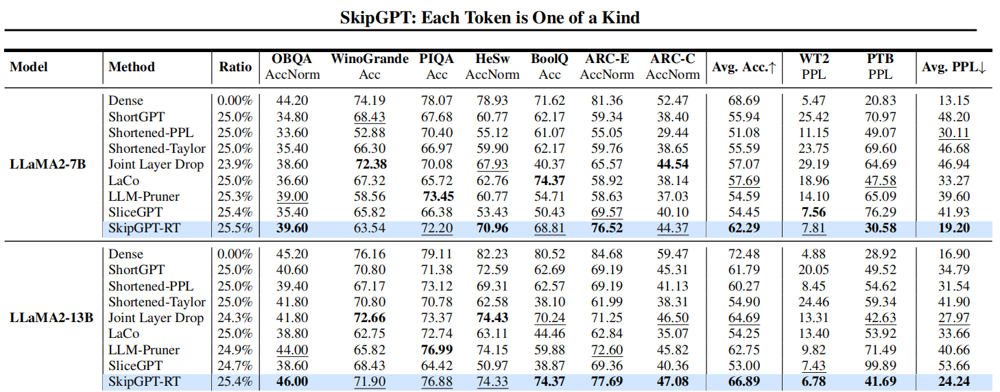

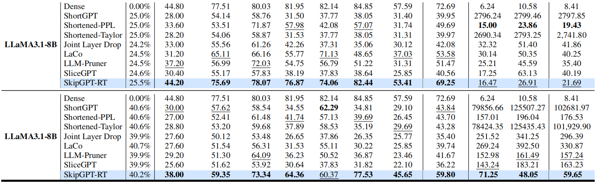

##### 路由器调优阶段的表现 (SkipGPT-RT)

表 1 展示了在 25% 稀疏度（即约 25% 的参数不参与计算）下，仅进行路由器调优（无 LoRA）的结果：

- 性能恢复：SkipGPT-RT 在 LLaMA2-7B 上平均准确率 62.29%，远超所有静态剪枝基线，甚至接近密集模型的 68.69%。
- 困惑度：在 WikiText2 和 PTB 上，SkipGPT-RT 的 PPL 远低于其他静态方法（如从 ShortGPT 的 48.20 降至 19.20），说明语言建模能力保持得更好。
- 高稀疏度：在 40% 稀疏度下，SkipGPT-RT 仍能保持较好的性能（平均准确率 59.80%），而静态方法几乎崩溃（如 ShortGPT 的 PPL 飙升至 10 万以上）。

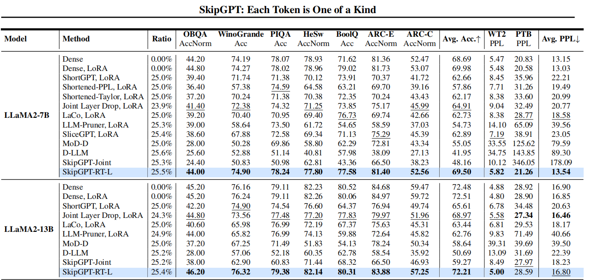

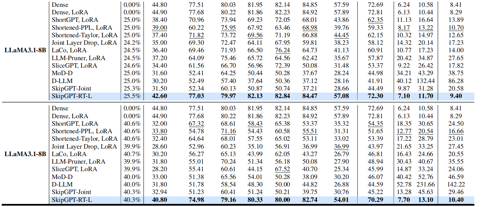

#### 两阶段训练后的表现 (SkipGPT-RT-L)

表 2 展示了经过第二阶段 LoRA 微调后的结果：

- 超越密集模型：在 LLaMA2-7B 上，SkipGPT-RT-L 的平均准确率 69.50%，不仅高于所有剪枝基线，甚至超过了原始密集模型 (68.69%) 和 LoRA 微调后的密集模型 (69.98%)。
- 一致性：在 LLaMA2-13B 和 LLaMA3.1-8B 上也观察到类似趋势，验证了方法的普适性。

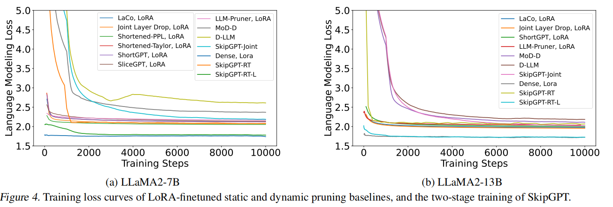

图 4 显示：

- 动态方法（MoD、D-LLM）在训练初期损失较高且波动大。
- 静态方法恢复训练（如 SliceGPT）收敛缓慢。
- SkipGPT 的两阶段训练曲线最平滑，收敛最快，最终损失最低，证明了其训练稳定性。

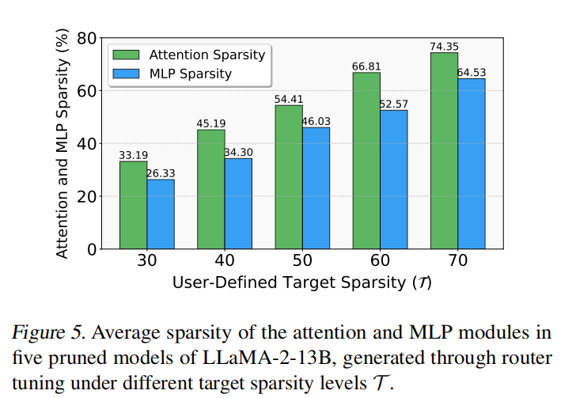

图 5 展示了在不同目标稀疏度下，SkipGPT-RT 对注意力和 MLP 模块的剪枝比例：

- 关键发现：在所有剪枝率下，注意力模块被剪掉的比例始终高于 MLP 模块。
- 结论：这揭示了当前 Transformer 架构中，注意力模块可能比 MLP 模块存在更多的结构性冗余。论文推测未来模型可以重新平衡两者的比例。

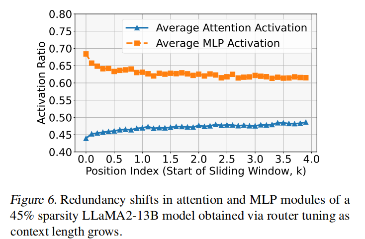

图 6 分析了在 45% 稀疏度模型中，随着上下文长度增加，注意力和 MLP 的激活率变化：

- 反直觉发现：
  - 随着上下文增长，后面的 token 需要更多的注意力计算（激活率上升）。
  - 同时，它们需要更少的 MLP 计算（激活率下降）。
- 论文推测：早期阶段模型需依赖 MLP 进行任务识别；后期任务明确，更依赖注意力进行上下文聚合。

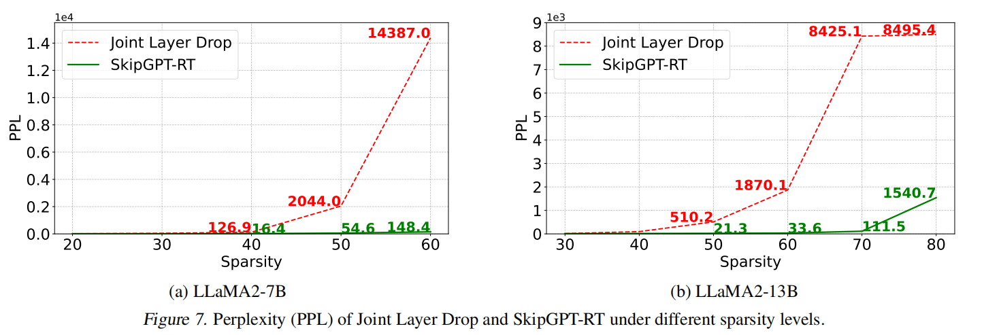

图 7 对比了 SkipGPT-RT 与 Joint Layer Drop 在不同稀疏度下的困惑度：

- 静态方法缺乏可扩展性：Joint Layer Drop 在 50% 稀疏度时 PPL 已显著上升。
- LLM 的惊人冗余：SkipGPT-RT 在 LLaMA2-13B 上直到 80% 稀疏度才出现明显的 PPL 增加，表明现有模型存在远超预期的冗余。

扩散模型

kimicode