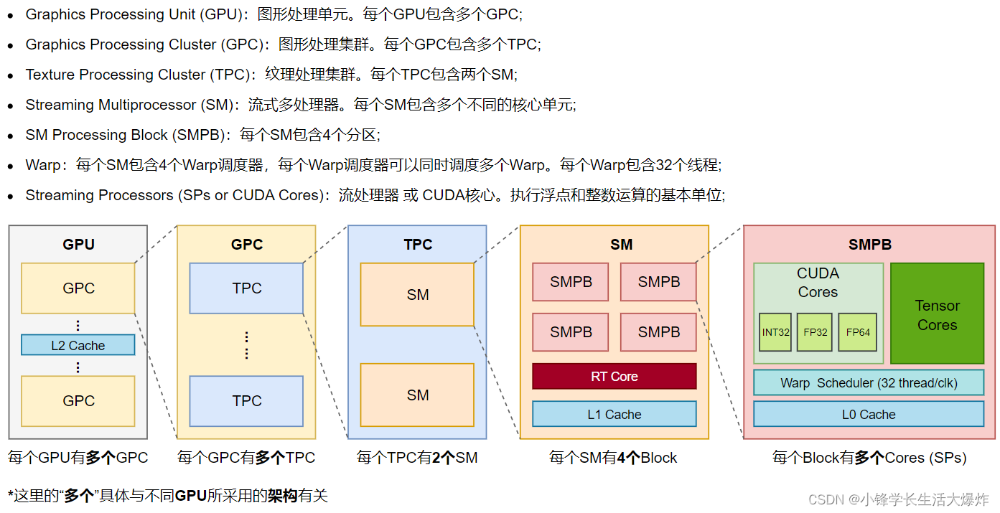
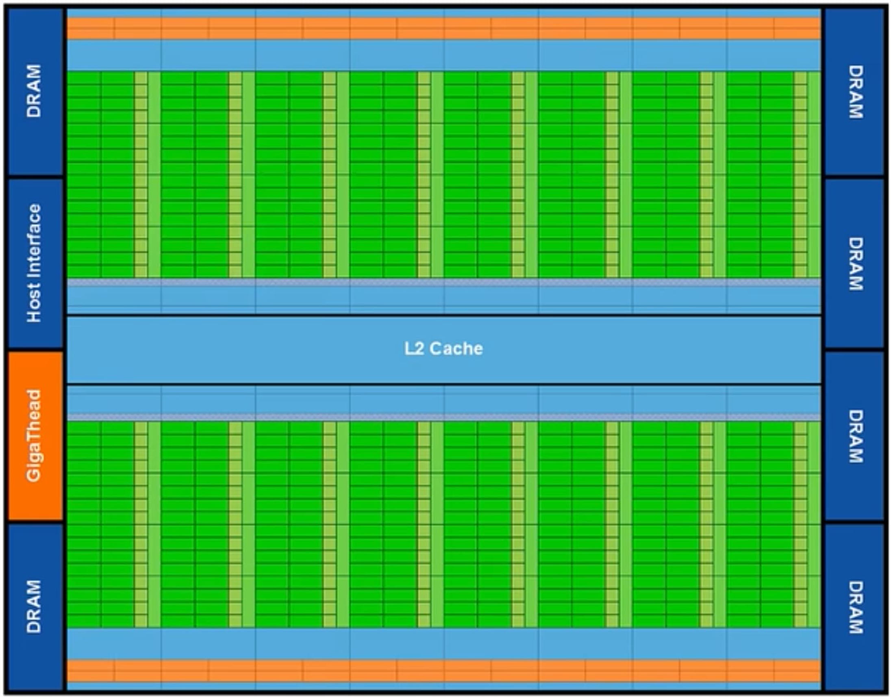

# GPU 组成详解：从硬件结构到 LLM 推理视角

> 面向 LLM 推理 / 调度研究者的 GPU 架构梳理：硬件分层、内存体系、执行模型、互联网络，以及它们如何决定 prefill/decode 的性能边界。

---



## 1. 设计哲学：GPU 为什么长这样

CPU 和 GPU 是两种截然不同的取舍：

| 维度       | CPU                              | GPU                                |
| ---------- | -------------------------------- | ---------------------------------- |
| 核心数     | 少量（8–96）                     | 海量（数千–上万 CUDA core）        |
| 单核能力   | 强：乱序执行、分支预测、大缓存   | 弱：顺序、轻量                     |
| 缓存       | 多层、大容量（MB 级 L3）         | 小而快（KB–MB 级 L1/L2）           |
| 内存带宽   | 50–500 GB/s                      | 1–8 TB/s（HBM）                    |
| 适合负载   | 低延迟、不规则控制流             | 高吞吐、规则并行（SIMD/SIMT）      |

直观类比：CPU 是几辆跑车，GPU 是几千辆共发的小巴。LLM 推理的本质——**大量同构矩阵运算**——天然契合 GPU 的设计。

---

## 2. 整体硬件层次：从芯片到 CUDA Core



NVIDIA GPU 自顶向下大致是：

```
GPU 芯片
 └── GPC (Graphics Processing Cluster) × 若干
      └── TPC (Texture Processing Cluster) × 若干
           └── SM (Streaming Multiprocessor) × 若干    ← 真正的"计算单元"
                ├── CUDA Core × 128
                ├── Tensor Core × 4
                ├── Warp Scheduler × 4
                ├── Register File (256 KB)
                ├── L1 Cache / Shared Memory (192 KB)
                ├── LD/ST Unit, SFU
                └── (Hopper 起) TMA、DPX、异步事务屏障
```


各代旗舰的关键参数（SXM 版）：

| 架构          | 卡型号  | SM 数 | FP16/BF16 TFLOPS | FP8 TFLOPS | HBM 容量 | HBM 带宽    |
| ------------- | ------- | ----- | ---------------- | ---------- | -------- | ----------- |
| Volta         | V100    | 80    | 125              | —          | 32 GB    | 0.9 TB/s    |
| Ampere        | A100    | 108   | 312              | —          | 80 GB    | 2.0 TB/s    |
| Hopper        | H100    | 132   | 989              | 1979       | 80 GB    | 3.35 TB/s   |
| Hopper        | H200    | 132   | 989              | 1979       | 141 GB   | 4.8 TB/s    |
| Blackwell     | B200    | 双 die| ~2250            | 4500       | 192 GB   | 8 TB/s      |

> 注：表中 TFLOPS 为稠密 Tensor Core 算力；稀疏（2:4）再 ×2。

**SM 是性能的最小独立单元**：一张 H100 同时能跑 132 个独立的工作组，warp 调度、寄存器、L1、shared memory 都按 SM 隔离。理解 GPU 性能基本等价于理解 SM 内部如何被填满。

---

## 3. SM 内部：算力的真正所在

以 H100 SM 为例，一个 SM 大致包含：

### 3.1 CUDA Core

通用标量算术单元，按数据类型划分：
- **FP32/FP64 Core**：传统科学计算
- **INT32 Core**：整数运算
- 每周期每核 1 op

CUDA core 的算力数值（H100 ~67 FP32 TFLOPS）听起来不小，但相对 Tensor Core 已经是配角——LLM 推理几乎所有性能都来自 Tensor Core。

### 3.2 Tensor Core（重点）

矩阵乘累加（MMA）专用单元，一条指令完成 `D = A × B + C`，其中 A、B、C 是小矩阵（典型 16×16×16）。代际能力：

| 代次          | 支持精度                                       | 典型用途           |
| ------------- | ---------------------------------------------- | ------------------ |
| Volta v1      | FP16 → FP32 累加                               | 训练               |
| Ampere v3     | + BF16, TF32, INT8                             | 训练 / 推理        |
| Hopper v4     | + FP8 (E4M3/E5M2)，**Transformer Engine** 自动混精 | LLM 推理利器       |
| Blackwell v5  | + FP4 (E2M1)，第二代 TE                        | 极致推理吞吐       |

Tensor Core 相对 CUDA core 的吞吐通常是 **8–32×**。这就是为什么 LLM 推理工程都在追"FP16 → FP8 → FP4"——精度每降一档，吞吐近乎翻倍。

### 3.3 Warp Scheduler

每个 SM 有 4 个 warp scheduler，每周期各发射一条 warp 指令。"warp"是 32 线程的束，是 GPU 调度的最小单位（详见第 5 节）。

### 3.4 Register File

每 SM 256 KB 寄存器（H100），分给当前驻留的所有线程。一个 thread 用太多寄存器会减少 SM 的"活跃 warp 数"（occupancy），CUDA 编译器会权衡寄存器与并行度。

### 3.5 L1 / Shared Memory

H100 上每 SM 共 256 KB（A100 是 192 KB），可在 L1 与 Shared Memory 之间**软件可配置**地切分：

- **L1 Cache**：硬件管理，对全局内存访问做缓存
- **Shared Memory**：软件管理，块内线程可见，速度 ~TB/s，是写高性能 kernel 的关键资源（FlashAttention、GEMM tiling 都重度依赖）

### 3.6 Hopper 新增单元

- **TMA (Tensor Memory Accelerator)**：异步 bulk 数据搬运，把 HBM 块拷到 shared memory 不再占线程，极大提升 GEMM/Attention kernel 的内存重叠
- **DSMEM (Distributed Shared Memory)**：同 cluster 内 SM 之间可直接互访 shared memory
- **Async Transaction Barrier**：与 TMA 配合的细粒度同步原语
- **DPX 指令**：动态规划专用（与 LLM 推理关系不大）

---

## 4. 内存层次：决定 LLM Decode 性能的关键

GPU 的内存金字塔决定了**带宽 vs 容量**的权衡。各层近似数据（H100）：

| 层级              | 容量            | 带宽          | 延迟（cycle） | 作用域           |
| ----------------- | --------------- | ------------- | ------------- | ---------------- |
| Register          | 256 KB / SM     | 极高          | ~1            | thread 私有      |
| Shared Memory / L1| 256 KB / SM     | ~33 TB/s      | ~30           | block 内共享     |
| L2 Cache          | 50 MB（全卡）   | ~5.5 TB/s     | ~200          | 全 SM 共享       |
| HBM3（Global）    | 80–141 GB       | 3.35–4.8 TB/s | ~500          | 全卡 + 主机可见  |
| Host DRAM (PCIe)  | TB 级           | 64 GB/s (Gen5)| 数千          | 跨卡时才碰       |

### 4.1 HBM：LLM 推理的真正瓶颈

LLM **decode 阶段**每生成 1 个 token，要把全部模型权重 + KV Cache 从 HBM 读一遍（attention 部分），算术强度（FLOPs / Bytes）很低，瓶颈在 **HBM 带宽**而不是算力。

例如 Llama-70B 在 H100 上 decode：
- 权重 ~140 GB（FP16），分到 8 卡每卡 17.5 GB
- 每生成 1 token 至少读完整权重一次：理论上限 ≈ 3.35 TB/s ÷ 17.5 GB ≈ **190 token/s/请求**
- 实际由于 KV Cache 也要读，会更低

这是为什么"H200 / B200 升级 HBM 容量与带宽"对 LLM 推理收益巨大——decode 直接随带宽线性提升。

### 4.2 L2：跨 SM 共享的中转站

H100 把 L2 加大到 50 MB，让一些热数据（小模型权重切片、attention 中间结果）能驻留 L2，减少打 HBM。L2 还按内存地址分 partition，访问需注意 partition 不平衡。

### 4.3 Shared Memory：写 kernel 的命脉

FlashAttention 之所以快，本质是把 attention 的 softmax + matmul 重排成"分块进 shared memory，online 累积，避免回写 HBM"。LLM 推理的每一项性能优化几乎都涉及 shared memory 的精细使用。

### 4.4 PCIe：跨卡 / 跨节点的瓶颈

PCIe Gen5 ×16 = 64 GB/s，比 HBM 慢约 **50×**，比 NVLink 慢约 **14×**。所以：

- KV Cache 一旦溢出到 CPU（vLLM swap）就慢得多
- 多卡推理时**必须用 NVLink**，PCIe 只用于装载初始权重

---

## 5. 执行模型：SIMT 与 Grid/Block/Warp

GPU 跑的是 **SIMT（Single Instruction, Multiple Threads）**：一组线程同时执行同一条指令、各自处理不同数据。

### 5.1 层次

```
Kernel launch
  └── Grid                  ← 一次启动的全部线程
       └── Block            ← 调度到单个 SM，可同步、可共享 shared memory
            └── Warp (32)   ← 真正的调度/执行单位
                 └── Thread ← 编程视角的最小单元
```

- **Grid → Block**：开发者按问题规模决定，受 GPU 限制（每 grid 最多 2³¹-1 个 block）
- **Block → Warp**：硬件按 32 线程一组切，Block size 通常取 128/256/512
- **Warp**：硬件调度单位，warp 内 32 线程**锁步**执行

### 5.2 Warp 调度

每个 SM 同时驻留多个 warp（H100 最多 64 个），warp scheduler 每周期挑选一个**就绪**的 warp 发射指令。"就绪"指它没有 stall（等内存、等同步）。

→ 关键：**Occupancy（活跃 warp 数）** 越高，越能用计算掩盖访存延迟。这是 CUDA 调优的核心指标之一。

### 5.3 Warp Divergence

warp 内 32 线程必须执行同一指令，遇到 `if/else` 时若各线程走不同分支，硬件会**串行**执行两侧、用掩码屏蔽不参与的线程。LLM kernel 一般控制流规整，divergence 不是大问题。

### 5.4 同步与协作

- **Block 内**：`__syncthreads()` 同步、shared memory 通信
- **Block 间**：默认无法同步，要靠 kernel 重启或 cooperative groups
- **Hopper Thread Block Cluster**：让若干 block 组成一个 cluster，可跨 SM 用 DSMEM 协作

---

## 6. 互联：多卡协作的网络

### 6.1 NVLink / NVSwitch

单机内多卡通信走 **NVLink**，远快于 PCIe：

| 代次       | 单链路带宽 | 每卡链路数 | 每卡总带宽 | 配套        |
| ---------- | ---------- | ---------- | ---------- | ----------- |
| NVLink 3   | 50 GB/s    | 12         | 600 GB/s   | A100        |
| NVLink 4   | 50 GB/s    | 18         | 900 GB/s   | H100        |
| NVLink 5   | 100 GB/s   | 18         | 1800 GB/s  | B200/GB200  |

**NVSwitch** 是把所有 GPU 全互联的交换芯片。8 卡 H100 服务器（HGX H100）通过 4 个 NVSwitch 实现任意两卡 **900 GB/s 全双工带宽**，是张量并行（TP）跨卡通信能跑满的前提。

### 6.2 跨节点：InfiniBand / RoCE

机间通常 200–400 Gbps IB / RoCE，配合 GPUDirect RDMA 让 GPU 显存直读对端 GPU 显存（绕过 CPU 内存）。

### 6.3 NVLink Switch / GB200 NVL72

Blackwell 一代的 GB200 NVL72 把 72 张 GPU 通过 NVLink Switch 直连成一个**统一的内存域**，跨卡 1.8 TB/s——专门为超大模型推理（>1T 参数）设计。

### 6.4 对推理的影响

| 并行策略       | 主要通信操作       | 通信量级               | 对网络的要求          |
| -------------- | ------------------ | ---------------------- | --------------------- |
| 张量并行 (TP)  | All-Reduce / 每层  | 每 token 数 GB         | NVLink 必备           |
| 流水并行 (PP)  | activation 传递    | 较小，但有气泡         | NVLink/IB 均可        |
| 数据并行 (DP)  | 仅同步少量状态     | 极小                   | PCIe 也行             |
| 专家并行 (EP)  | All-to-All / 每层  | 中等，但路由复杂       | NVLink Switch 优势大  |

---

## 7. CUDA 软件栈：从源码到 SM

```
PyTorch / vLLM Python
    ↓
CUDA C++ kernel (.cu)
    ↓
nvcc → PTX (中间表示)
    ↓
ptxas → SASS (架构相关汇编)
    ↓
GPU 驱动加载 SASS 到 SM 执行
```

关键库（推理常见）：

- **cuBLAS / cuBLASLt**：BLAS（含 GEMM）
- **cuDNN**：传统 CV 算子
- **CUTLASS**：模板化 GEMM/Conv kernel，可深度定制（FlashAttention 部分基于此）
- **TensorRT / TensorRT-LLM**：推理图优化、kernel fusion、量化
- **Triton**：OpenAI 出的 Python DSL，写自定义 kernel 比 CUDA C++ 简洁很多（vLLM 大量自研 kernel 用 Triton）
- **NCCL**：多卡集合通信（All-Reduce、All-Gather 等）

---

## 8. LLM 推理视角：硬件特性如何映射到 prefill / decode

把上面的硬件知识投影到 LLM 推理的两个阶段：

### 8.1 Prefill：算力受限（Compute-bound）

- 一次前向处理整段 prompt（数百到数千 token），matmul 维度大
- **算术强度高**（FLOPs / Bytes 大）→ **Tensor Core 利用率高**
- 性能上限 ≈ Tensor Core 峰值 × 利用率（实测 H100 FP8 能跑到 1500+ TFLOPS）
- 瓶颈：**算力**

### 8.2 Decode：带宽受限（Memory-bound）

- 一步只处理 1 个新 token，matmul 退化为矩阵 × 向量
- **算术强度极低**（每 byte 权重只贡献 ~2 FLOPs）→ Tensor Core 用不满
- 瓶颈：**HBM 带宽**

### 8.3 Roofline 视角

```
吞吐 = min(算力峰值, 算术强度 × 带宽)
```

- Prefill：算术强度高，落在屋顶水平段（compute-bound）
- Decode：算术强度低，落在屋顶斜坡（memory-bound）

→ 两阶段的硬件瓶颈完全不同，这正是 vLLM 的 **chunked prefill** 把两者混合调度能提升整体利用率的根本原因：在同一个 batch 里，让 decode（吃带宽）和 prefill（吃算力）共用一次 HBM 读取，提高每次"权重读上来"的摊销效益。

### 8.4 Batch Size 的硬件意义

decode 阶段把多个请求 batch 在一起，权重只读一次但服务多个 query：
- batch=1：算术强度极低，远不及 roofline 拐点
- batch=N：算术强度近似 ×N，逐渐逼近算力上限

这是为什么 **vLLM 努力把 batch 拉大** 的硬件根源。但 batch 大 → KV Cache 占用大 → 受 HBM 容量限制 → 这就回到了 PagedAttention 解决的问题。

### 8.5 KV Cache 与 HBM 容量

每 token 的 KV Cache 大小：
```
2 (K+V) × num_layers × num_kv_heads × head_dim × bytes_per_element
```
Llama-70B FP16：约 **160 KB / token / 序列**。80 GB H100 减去 ~70 GB 模型权重切片（TP=2 时单卡 35GB），剩 ~45 GB 给 KV → ~28 万 token 总预算。这个数字直接决定能跑多大并发。

---

## 9. 主流卡型对比（推理工程视角）

| 卡型     | HBM      | 带宽     | FP16 算力 | FP8 算力 | NVLink     | 适合场景                       |
| -------- | -------- | -------- | --------- | -------- | ---------- | ------------------------------ |
| A100 80G | 80 GB    | 2.0 TB/s | 312 TF    | —        | 600 GB/s   | 通用训练/推理基线              |
| L40S     | 48 GB    | 0.86 TB/s| 362 TF    | 733 TF   | ❌(PCIe)   | 中等推理，性价比               |
| H100     | 80 GB    | 3.35 TB/s| 989 TF    | 1979 TF  | 900 GB/s   | LLM 训练/推理主力              |
| H200     | 141 GB   | 4.8 TB/s | 989 TF    | 1979 TF  | 900 GB/s   | 大模型推理（KV 容量大）        |
| B200     | 192 GB   | 8 TB/s   | 2250 TF   | 4500 TF  | 1800 GB/s  | 下一代旗舰                     |
| RTX 4090 | 24 GB    | 1 TB/s   | 165 TF    | 660 TF   | ❌         | 个人 / 单机小模型              |

**选择经验**：
- 模型 + KV 装得下用单卡（HBM 容量是硬约束）
- 装不下用 TP，且必须有 NVLink
- decode 吞吐看 HBM 带宽，prefill 吞吐看 Tensor Core
- 长上下文（≥32K）优先选 HBM 容量大的（H200 / B200）

---

## 10. 与 vLLM / 调度研究的连接点

把硬件结构串回你关心的调度问题：

1. **SM / warp 调度 vs 请求调度**：底层硬件已经在毫秒以下做着 warp 级动态调度，软件层（vLLM scheduler）做的是请求级调度。两者解耦但相互制约——比如一次 batch 太大会引起寄存器压力下降 occupancy，反而拖慢单步耗时
2. **HBM 容量是 KV Cache 的硬上限**：PagedAttention 的"块"本质就是把 HBM 切片管理。调度器决定何时驱逐/swap 时，对 HBM 状态的建模直接影响 SLO
3. **HBM 带宽是 decode TPOT 的下限**：在带宽受限阶段，无论怎么调度都跑不过物理上限。所以基于长度预测的调度，**核心收益不是单步加速**，而是减少抢占次数与提升并发数
4. **PCIe 带宽是 swap 代价的来源**：被 swap 出 GPU 的请求恢复时要走 PCIe（64 GB/s vs HBM 3.35 TB/s），这就是 vLLM 的 swap 比 recompute 慢的硬件根源；长 prompt 选 swap 优势源于"prefill 算力代价 > PCIe 拷贝代价"
5. **Tensor Core 精度阶梯**：FP16 → FP8 → FP4 每降一级吞吐近翻倍，但 KV Cache 量化要单独考虑，这是另一条与调度并行的优化路径
6. **NVLink 让 TP 成为可能**：跨卡 All-Reduce 的延迟直接进入每步 decode 时间，调度模型若忽略它会高估并行加速比

---

## 11. 一张图：硬件视角的 LLM 推理数据流

```
   ┌─────────────────────────────────────────────────────────────┐
   │  CPU + Host DRAM        │  PCIe Gen5 64 GB/s  │              │
   │  - 调度器决策            │ ←——————————————————→ │              │
   │  - 请求队列              │  (装载/swap)         │              │
   └─────────────────────────────────────────────────────────────┘
                                    │
                                    ▼
   ┌─────────────────────────────────────────────────────────────┐
   │                     GPU (H100 示意)                          │
   │  ┌──────────────────────────────────────────────────────┐  │
   │  │                    HBM3  80 GB  3.35 TB/s             │  │
   │  │   [模型权重切片] [KV Cache 大张量(若干 paged blocks)]  │  │
   │  └──────────────────────────────────────────────────────┘  │
   │              ▲ 5.5 TB/s ▼                                   │
   │  ┌──────────────────────────────────────────────────────┐  │
   │  │                    L2 Cache  50 MB                    │  │
   │  └──────────────────────────────────────────────────────┘  │
   │              ▲ 33 TB/s ▼                                    │
   │  ┌──────────┐ ┌──────────┐ ┌──────────┐ … 132 个 SM        │
   │  │   SM 0   │ │   SM 1   │ │   SM 2   │                    │
   │  │ Register │ │ Register │ │ Register │                    │
   │  │ Shared   │ │ Shared   │ │ Shared   │                    │
   │  │ TensorCore│ │TensorCore│ │TensorCore│                    │
   │  └──────────┘ └──────────┘ └──────────┘                    │
   └─────────────────────────────────────────────────────────────┘
                                    │
                                    ▼ NVLink 900 GB/s
                          (其它 GPU, 用于 TP/PP)
```

---

## 12. 一句话总结

GPU 的本质是**用海量并行的小核 + 多层带宽递减的内存 + 张量专用单元 + 高带宽互联**，在牺牲单核灵活性的代价下换取极高的吞吐密度。LLM 推理的所有性能现象——prefill 算力受限、decode 带宽受限、batch 越大越省、PagedAttention 解决 KV 碎片、TP 必须配 NVLink、量化降精度提吞吐——都是这个硬件骨架在不同维度上的直接映射。

对调度研究而言：**把硬件资源看作"算力 / HBM 带宽 / HBM 容量 / 互联带宽"四类有限资源**，每个调度决策就是在这四类资源上做分配；长度预测的价值正是让这种分配在时间维度上变得可预知。

