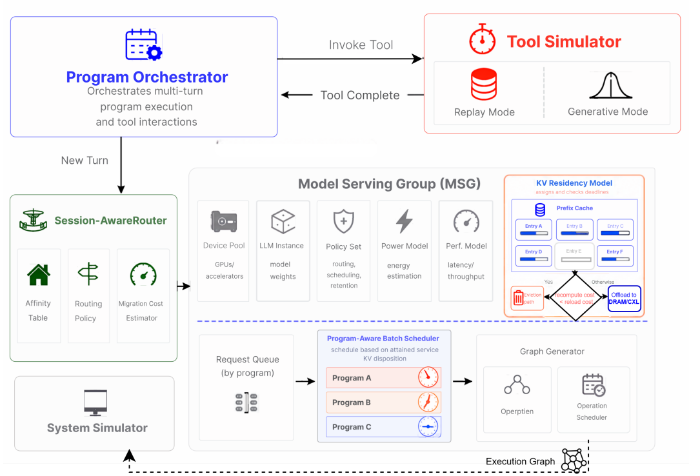

# AgentServeSim核心方法

## 1.**Program Orchestrator** 程序编排器

（i）跟踪每个程序的轮次顺序和未完成工具状态

（ii）将程序标识传播到每个下游事件，使路由器、调度器和驻留模型以程序粒度操作

（iii）在模拟时间中保持轮次t+1，直到轮次t的工具间隙结束；

## 2. Tool Simulator 工具模拟器

提供两种模式：重放模式、生成模式

重放模式中，完全按照真实记录过的工具耗时来模拟。

生成模式中，它从每个工具的条件分布中采样持续时间，基于工具名称（如`grep`、`python`或`git`）。

在工具间隙期间，KV状态由KV驻留模型（§3.5）管理。两种模式共同支持忠实的轨迹重现和对替代工具延迟机制的可控探索。

## 3. Session-AwareRouter 会话感知路由

（i）默认将程序的连续轮次保留在同一引擎上

（ii）如果这个任务原来的引擎太忙了，系统可以考虑别的方案，但不能偷偷把它发到别的引擎，并假装没有额外代价。

（iii）如果不得不破坏局部性，比如迁移 KV 或重新 prefill，就要把这部分额外成本告诉调度器，让调度器判断哪个方案更划算。

## 4 Scheduler 程序感知批调度器

1. 以**程序身份**作为队列键；
2. 将程序级状态，例如**已获得服务量**、**历史信息**，暴露给一个**可插拔策略钩子**；
3. 保留现有的**准入控制**和**连续批处理**逻辑，使不同竞争策略之间只在**排序逻辑**和 **KV 处置逻辑**上有所不同。

调度器读取由 Orchestrator 标记的程序身份，并查询一个策略钩子。该策略钩子会返回：

- 一个调度排序；
- 一个针对每一轮的 KV 处置决策。

## 5 KV驻留模型

- 为每个程序的 KV 节点打上由策略定义的**截止时间 **TTL；
- 显式处理内存压力；
- 跨越多级存储，包括 **HBM**、**主机 DRAM** 和 **CXL**；
- 将 **swap-to-host**，即换出到主机内存，作为一个独立的策略原语暴露出来。

当进入工具间隙时，Orchestrator 会为该程序的 KV 节点分配截止时间。驱逐操作会尊重这些截止时间，除非内存压力迫使系统覆盖该决策。

tokencake